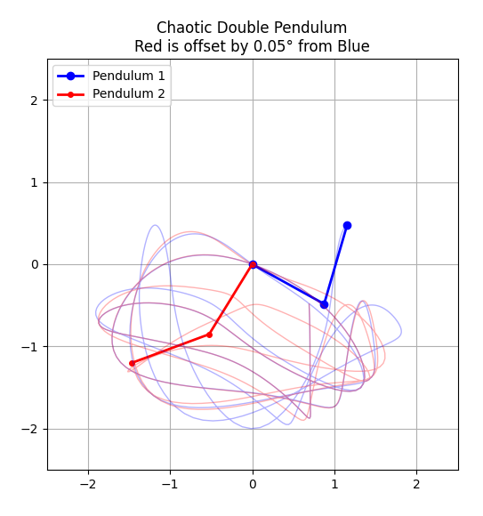

# Chaotic Double Pendulum

A physics simulation of a chaotic double pendulum demonstrating sensitive dependence on initial conditions.

 

## Overview

This project simulates two double pendulums with nearly identical starting positions (offset by just 0.05°) to visualize chaos theory in action. Despite starting almost identically, the pendulums quickly diverge into completely different trajectories, beautifully illustrating the butterfly effect.

## Features

- **Realistic Physics**: Equations of motion derived from Lagrangian mechanics
- **Animated Trails**: Watch the paths traced by each pendulum build up over time
- **Side-by-Side Comparison**: Blue and red pendulums show divergence from tiny initial differences
- **60 FPS Animation**: Smooth visualization of the chaotic motion

## Requirements

```bash
pip install numpy matplotlib scipy
```

## Usage

Simply run the simulation:

```bash
python simulation.py
```

The animation will display two pendulums swinging freely. Press Ctrl+C to stop.

## The Physics

The double pendulum is one of the simplest systems to exhibit chaotic behavior. The centrifugal forces and gravitational interactions create a non-linear system where small changes in initial conditions lead to drastically different outcomes.

## Parameters

- **Arm lengths**: L1 = L2 = 1.0 m
- **Bob masses**: m1 = m2 = 1.0 kg
- **Initial angles**: θ1 = 120°, θ2 = -10°
- **Offset between systems**: 0.05°
